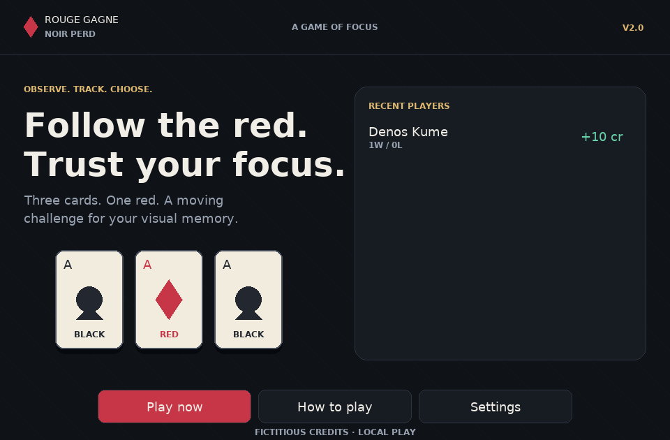
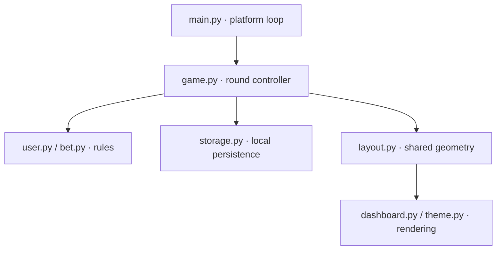
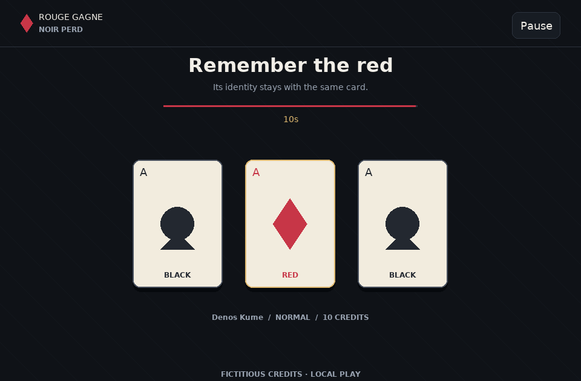

<p>
  
</p>
<p align="right"><strong>MSc. CORO DASSIP</strong></p>
<br clear="both">

<h1 align="center">Python CardGame · V2</h1>
<p align="center"><strong>Rouge gagne, noir perd</strong><br>A visual-memory game for desktop and the browser.</p>
<p align="center"><a href="https://denoskume.github.io/Python-CardGame/">Play in your browser</a> · <a href="#run-on-desktop">Run on desktop</a> · <a href="docs/verification-v2.md">Verification notes</a></p>



Follow one red card through an animated shuffle, then choose its final position. V2 keeps the original game idea and brings a consistent interface, explicit round rules and the same Python engine to both desktop and web.

## What is included

- Responsive table with mouse, keyboard and touch controls.
- Three difficulty levels, optional audio and a pause that preserves the timer and card positions.
- Local profiles, a one-time welcome balance, recent-player results and session statistics.
- Validated stakes and one settlement per round, including deadline handling.
- Desktop JSON storage and browser localStorage, with graceful failure when saving is unavailable.

All credits are fictitious. No payments, online accounts or real-money transactions are involved.

## Problem statement

Build an event-driven three-card tracking game that remains responsive during animation. Card identity must stay consistent as positions change; input, timers, rendering and saved results must agree on the outcome of every round.

The main engineering constraints are non-blocking animation, correct balance accounting, reliable pause/resume and resize behavior, usable small-screen layouts, and shared desktop/browser rules.

## Rules

| Setting | Value |
| --- | --- |
| Cards | One red, two black |
| New-profile balance | 30 credits, granted once |
| Base stake | 10–1000 credits, adjusted in steps of 5 |
| Multipliers | ×1, ×2, ×3 |
| Total stake | Base stake × multiplier; must fit the available balance |
| Observation / shuffle / choice | 10 seconds each |
| Correct choice | Add one total stake as net profit |
| Wrong choice or timeout | Subtract one total stake |
| End of session | Balance below 10 credits |
| Saved history | Latest 200 rounds on this device |

The stake is fixed when a round starts. Repeated input cannot settle the same round twice. A selection at or after the deadline counts as a timeout. Returning to the menu does not refill an existing profile's balance.

| Difficulty | Pause between exchanges / exchange duration |
| --- | --- |
| Easy | 420 / 420 ms |
| Normal | 300 / 300 ms; speeds up after consecutive wins |
| Expert | 150 / 150 ms |

Normal uses 240 ms after two consecutive wins, 200 ms after three, and 170 ms after four or more. A loss, profile change or difficulty change resets the streak.

## Run on desktop

Python 3.12 is the CI reference environment.

```bash
git clone https://github.com/denoskume/Python-CardGame.git
cd Python-CardGame
python -m venv .venv
source .venv/bin/activate
python -m pip install -r requirements.txt
python src/main.py
```

On Windows PowerShell, activate with `.venv\Scripts\Activate.ps1` instead. Native Windows/macOS execution and physical mobile devices have not been independently validated in this environment; see the verification notes for tested coverage.

## Controls

| Action | Control |
| --- | --- |
| Activate a button | Click, touch, or Tab then Enter |
| Enter a name | Native text field; spaces and accented characters supported |
| Choose a card | Click/touch, or 1 / 2 / 3 for left / centre / right |
| Pause an active round | Space or Pause button |
| Resume | Space or Resume button |
| Close help/settings | Escape or Back |

Losing window focus pauses an active round. Resume explicitly when ready. Difficulty and sound are available from Settings; a chosen difficulty applies to the next round.

## Requirements and approach

| Requirement | Implementation |
| --- | --- |
| Same rules on both platforms | Shared Python/Pygame controller; Pygbag browser packaging |
| Responsive interaction | Asynchronous event → update → render loop |
| Fair tracking | Permanent card identity, logical slots and smooth interpolated swaps |
| Accurate timers | Elapsed-time transitions; paused time excluded |
| Safe accounting | Full-stake validation, frozen round inputs and settlement guard |
| Reliable interface | Shared layout rectangles for rendering and input |
| Efficient rendering | Cached fonts, avatar scaling and static background |
| Recoverable storage | Field validation, bounded history, atomic desktop writes and in-memory fallback |
| Browser usability | Native HTML name field aligned to the canvas; visible loading/retry feedback |

## Architecture and theory



The finite-state controller progresses through profile setup, betting, observation, shuffling, selection and result. A pause preserves the active state and shifts its time origin on resume. Rendering reads the current state without changing it.

Each card owns its red/black identity and a logical slot. Swapping moves two cards along separate curved paths, using smoothstep interpolation `u²(3−2u)`. Resizing recomputes screen coordinates from logical slots and exchange progress instead of inventing a new shuffle.

For accepted stake `s` and balance `B`, a win gives `B + s`; a loss gives `B − s`. Since the whole stake is checked before starting, the game does not silently cap it at settlement. Session net profit is the sum of these signed changes, rather than a gross payout total.

| Module | Responsibility |
| --- | --- |
| `src/main.py` | Platform setup and asynchronous loop |
| `src/game.py` | States, input dispatch, timers, motion and settlement |
| `src/user.py`, `src/bet.py` | Player balance and wager validation |
| `src/settings.py` | Difficulty and audio preferences |
| `src/storage.py` | JSON/localStorage validation and persistence |
| `src/layout.py` | Shared responsive geometry |
| `src/dashboard.py`, `src/theme.py` | Screens and cached visual resources |
| `src/menu_input.py` | Native browser text entry |
| `src/game_statistics.py`, `src/history_table.py` | Session and recent-player summaries |

## Test and build

```bash
python -m unittest discover -s tests -v
python -m compileall -q src
bash scripts/build_web.sh
python -m http.server 8000 --directory src/build/web
```

The web build also needs FFmpeg. Open `http://localhost:8000` after building. The first browser visit downloads the Python/Pygame runtime, so it is slower than subsequent visits. GitHub Actions runs tests and builds the web bundle; only `main` is deployed to GitHub Pages.

Reproduce screen captures without changing player data:

```bash
python scripts/capture_screens.py --output /tmp/cardgame-screens
```

## Persistence and limits

Desktop data is stored in `data/history.json`, `data/profiles.json` and `data/settings.json`; these runtime files are not committed. Browser data stays in localStorage on the current origin. V2 retains the original profile/history keys so existing valid records remain readable.

There is no cloud synchronization, authentication or protected leaderboard. Clearing browser data removes local progress. If writing is refused, gameplay continues in memory with a visible warning. Credits and history are local game state, not tamper-proof records.



## Project documentation

- [V2 design](docs/superpowers/specs/2026-10-03-cardgame-v2-design.md)
- [Implementation plan](docs/superpowers/plans/2026-10-03-cardgame-v2.md)
- [Verification and limitations](docs/verification-v2.md)
- [Changelog](CHANGELOG.md)
- [Original academic report](docs/CardGame_Report.pdf) — describes the earlier version.
- [Original gameplay demo](docs/cardgame_demo.gif) — retained as historical material, not a V2 demonstration.

## Participants

Denos Kume  
Sena FUKABE

**Python · Pygame · Object-oriented programming · Finite-state machines · Animation · JSON · WebAssembly**

Bundled DejaVu fonts retain their [license](src/assets/FONT-LICENSE.txt).
